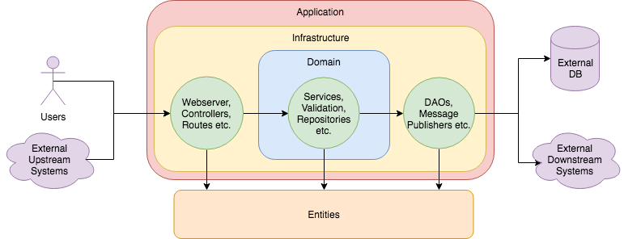

# Some Code Challenge

## Architecture

### Language choice

In the end I decided to use Kotlin because it's a language I've been meaning to do something for a while and it seemed like a good excuse to learn it :)

### Organization



I implemented this service in a halfway between "traditional" DDD and hexagonal architecture.

Each one of the top-level packages represent a layer of the system. They're all in the same code-base (for simplicity purposes) but they could be in different modules, different code-bases, and even written in different languages, given a more modular interface.

The layers are:

* **Entity**: Here are the system's models. All models are `data classes`, for immutability. They don't have any logic, but if they did, they should be **pure functions**, meaning they wouldn't deal with state. This layer is cross-cutting and is accessible by **all other layers**, but doesn't access any other.
* **Domain**: This layer contains all logic that's relevant to the business. It doesn't have any knowledge of how the information is persisted, for example, or where the inputs of the services come from. All **core business logic** resides here. It's the heart of the application. It's the equivalent to the "hexagon", in hexagonal architectures.
* **Infrastructure**: This layer deals with all kinds of **inputs and outputs external to the system**. Remember when I said this architecture is a middle-ground between DDD and hexagonal? Here are some differences: i) In DDD, the Infrastructure layer is at the bottom of the stack and doesn't have any knowledge of the services using it. It basically doesn't interact with external inputs; ii) Differently than DDD (and more akin to hexagonal) I also followed the approach where the infrastructure layer is responsible for "ports and adapters" dealing with **all** external inputs (from users, other applications etc.), such as the web server routes and controllers; and external outputs, such as writing to a (potentially) external database; iii) I didn't use "ports and adapters" *per se* because I thought it would be too complex for this example, without adding much value, but the real issue might be my lack of familiarity with it as well :P
* **Application**: this layer contains a single file, with the application entrypoint. It represents whatever dependency injection or wiring framework that knows how to properly use **all the other layers** to spin up a service, i.e. the **Main Component**.

### Dependencies

As a main philosophy, I tried to keep dependencies at a bare minimum. As it's a simple project, I didn't even want to use dependency injection and did (almost) everything manually.

I wanted to use an HTTP micro-framework (like Ruby's Sinatra or Python's Flask) to build the API itself and keep it really simple, to focus on the "business" logic itself.

I googled "sinatra for kotlin", and [**Javalin**](http://javalin.io/) was the first hit, so I went with it :P

I added **Jackson** for dealing with the JSON inputs and outputs, **Junit5** for testing and **Mockk** as the mocking framework.

I also wrote some "integration tests", which turn on the webserver and issue HTTP requests against it, validating the outputs. To do the requesting, I also added [**khttp**](https://khttp.readthedocs.io/en/latest/).

### Database

As it's a simple example, I didn't connect any external database to the project, and used a simple in-memory HashMap to simulate it. In a real world scenario, using an external database, the DAO that connects to it would send external commands (e.g. SQL; using a Client etc.) instead of simply manipulating the HashMap. It's important to note that, as the internal database is in-memory, it **will be erased** every time you close the application.

## Assumptions

I assumed that you didn't want an application that handled "real world" scenarios, such as validating a Credit Card number with its flag/brand, generating valid Boleto numbers or simply validating a customer CPF. I added some, let's say, "business validations" as examples, to show potential extensibility, but I cared more about *how the different classes interact* than what they *actually do*. You can also see that in the `PaymentStatusType` enum as well: there's only 3 different states. In a more real-world scenario, each `PaymentType` would have dozens of different status types.

As mentioned above in the **Database** section, I used an in-memory "mock" database with a HashMap implementation. As the challenge said to use "any database", I also assumed using an external database (relational or non-relational) wasn't really needed, given the right interfaces were in-place.

I assumed I didn't need to comment the code (i.e. Javadoc etc.), so I only added comments to clarify potential assumptions I made or points which could be improved, *especially`* in a real-world scenario.

The last assumption worth mentioning is that, although the challenge mentions "an API to check the status of a Payment" (which I did), I didn't add any mechanisms to actually **change** that status after the Payment is created - I assumed it wasn't needed.

## Usage

### Start the application

Using Gradle: `gradle run`

Using Docker: `docker-compose up`

The webserver will be available in port 7000.

### Run tests

Using Gradle: `gradle cleanTest test`

Using Docker: `docker-compose run --rm app gradle cleanTest test`

To generate a coverage report, you can, after running the tests, run `gradle jacocoTestReport`. The report will be in `build/jacocoHtml/index.html`.

Coverage is at 99% lines / 93% branch.

## Example usage

After the webserver is running, you can issue HTTP requests for it.

You can use the files inside `src/test/resources/examples/inputs` as payloads for the application.

1. Verify application routes:

`curl http://localhost:7000/`

Response (**200**):

```json
[
  {
    "path": "/payments",
    "httpMethod": "POST"
  },
  {
    "path": "/payments/:payment-id",
    "httpMethod": "GET"
  }
]
```

2. Create a payment of type Boleto:

`curl -X POST http://localhost:7000/payments -d @src/test/resources/examples/inputs/boleto_payment.json`

Response (**201**):

```json
{
    "id": 1,
    "status": {
        "paymentStatusType": "NOT_PAID"
,    },
    "information": {
        "buyer": {
            "name": "John Doe",
            "email": "john.doe@gmail.com",
            "cpf": "12345678901"
        },
        "chargeInformation": {
            "amount": 123.45,
            "type": "BOLETO",
            "boleto": {
                "typableNumber": "584051819121392899615123004846620201972626652126",
                "expirationDate": "2019-08-21"
            }
        }
    }
}
```

3. Create a payment of type Credit Card:

`curl -X POST http://localhost:7000/payments -d @src/test/resources/examples/inputs/credit_card_payment.json`

Response (**201**):
```json
{
    "id": 2,
    "status": {
        "paymentStatusType": "NOT_PAID"
    },
    "information": {
        "buyer": {
            "name": "John Doe",
            "email": "john.doe@gmail.com",
            "cpf": "12345678901"
        },
        "chargeInformation": {
            "amount": 4567.89,
            "type": "CREDIT_CARD",
            "creditCard": {
                "holderName": "John Doe",
                "number": "4567890123456789",
                "expirationDate": "2077-07-31",
                "cvv": "999"
            }
        }
    }
}
```

4. Check a persisted Payment with its status:

`curl http://localhost:7000/payments/2`

Response (**200**):

```json
{
    "id": 2,
    "status": {
        "paymentStatusType": "NOT_PAID"
    },
    "information": {
        "buyer": {
            "name": "John Doe",
            "email": "john.doe@gmail.com",
            "cpf": "12345678901"
        },
        "chargeInformation": {
            "amount": 4567.89,
            "type": "CREDIT_CARD",
            "creditCard": {
                "holderName": "John Doe",
                "number": "4567890123456789",
                "expirationDate": "2077-07-31",
                "cvv": "999"
            }
        }
    }
}
```
